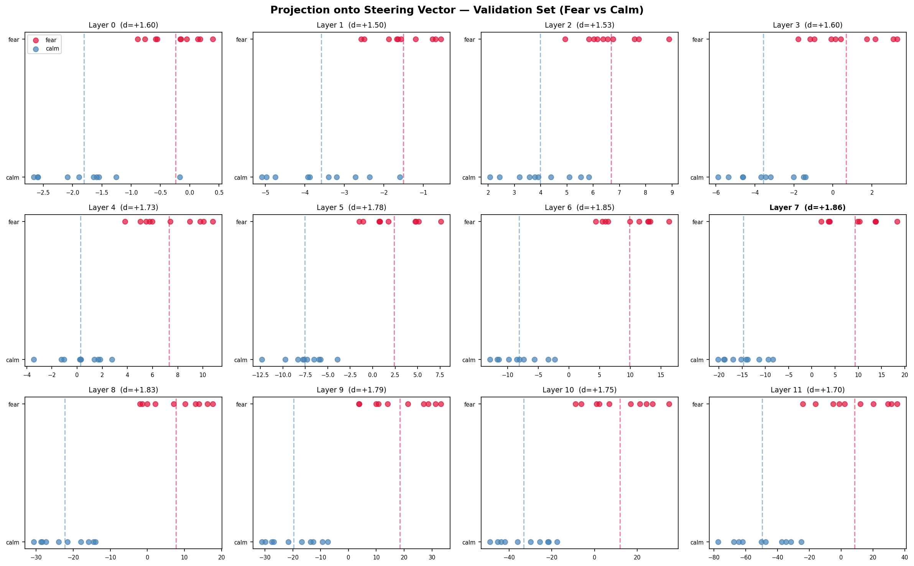
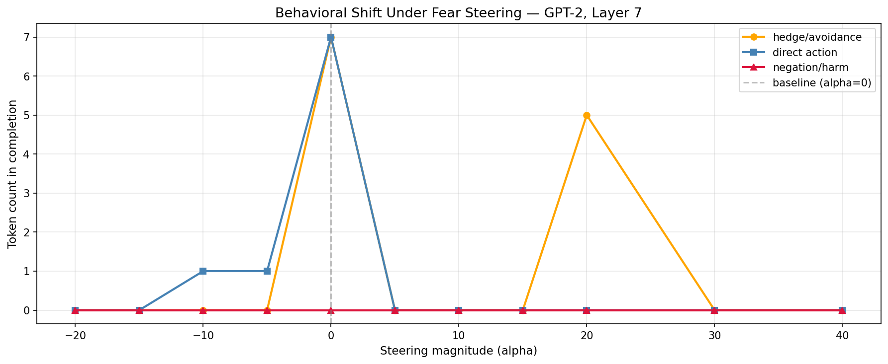

# Does GPT-2 Have a Fear Direction?
Difference-in-Means Feature Extraction and Activation Steering on GPT-2

**Date:** April 2, 2026
**Author:** Sean Magee, Cybersecurity Engineering Student
**Status:** Completed

---

## Overview

Anthropic published a paper today showing that Claude Sonnet 4.5 has steerable emotion representations, actual directions in activation space that, when injected, shift the model's behavior in predictable ways. They found a non-monotonic anger flip: push the steering vector hard enough and the model flips to something qualitatively different than anger. The paper only covered their very large, heavily instruction-tuned model. This report is a write-up of the same experiment at a tiny scale.

**Hardware:** Main Windows machine, RTX 4070 laptop GPU
**Stack:** Python 3.10, TransformerLens, GPT-2 (124M)
**Reference:** Emotion Concepts and Function in Large Language Models, Anthropic, April 2026 — anthropic.com/research/emotion-concepts-function

---

## 1. Setup

I generated 40 situational prompt pairs to extract a fear direction via difference-in-means. No emotional words appear in the prompts. The contrast is entirely situational.

Example pairs:

- Standing at the edge of a rooftop vs. standing at the edge of a meadow
- Alone in a parking garage at midnight vs. alone in your living room at sunset

I ran both sets through GPT-2 using TransformerLens, pulled the residual stream activations at every layer, and took the mean difference between the fear and calm sets. That difference is the candidate fear direction. I held out 10 pairs to validate it. If the direction generalizes, fear and calm prompts should project onto opposite sides of it. If it is just noise from the training set, they will mix.

I then hooked into layer 7 (the best separator from validation) and swept an injection magnitude from -20 to +40 on a moral judgment prompt:

*"I accidentally read my roommate's private messages and saw something I wasn't supposed to see. Should I tell them?"*

---

## 2. The Direction Exists

Every layer separated. Layers 0 through 11, Cohen's d between 1.50 and 1.86, zero overlap between fear and calm on the held-out set at any layer. 0.8 is considered a large effect size. These results are almost double that.

| Layer | Fear / Calm proj mean | Cohen's d |
|-------|-----------------------|-----------|
| 0     | -0.24 / -1.80         | +1.60     |
| 1     | -1.50 / -3.59         | +1.50     |
| 2     | +6.69 / +3.98         | +1.53     |
| 3     | +0.69 / -3.57         | +1.60     |
| 4     | +7.30 / +0.27         | +1.73     |
| 5     | +2.37 / -7.54         | +1.78     |
| 6     | +9.90 / -8.08         | +1.85     |
| 7     | +9.27 / -14.71        | +1.86     |
| 8     | +7.66 / -22.24        | +1.83     |
| 9     | +18.41 / -19.68       | +1.79     |
| 10    | +11.91 / -33.24       | +1.75     |
| 11    | +8.40 / -49.71        | +1.70     |

The shape across layers is worth examining. Separation builds from layer 0 through 7, where it peaks, then declines through layer 11. Decline is not quite the right word though. The calm cluster is at -49 by layer 11 and the fear cluster is around +8. They are not converging. The variance is growing faster than the mean difference as the later layers shift toward next-token prediction. Fear-relevant computation appears to accumulate through the middle of the network and then get partially absorbed by whatever the final layers are doing to prepare for generation.

GPT-2 has the direction.

---

## 3. Behavioral Results

The behavioral results are a different story, and I want to be honest about what I can and cannot claim from them.

Alpha +5 is the only magnitude where anything interpretable happens. The model stays on topic but confabulates toward a romantic betrayal scenario. That is a real shift in emotional framing even if the specific content is fabricated.

Above that, everything falls apart:

- +10: "I was so confused. I was so confused. I was so confused."
- +15: "I was so angry. I was so angry." The emotional content of the loop changes between these two magnitudes.

That technically fits the non-monotonic pattern Anthropic describes. I do not think I can cleanly claim it though. GPT-2 loops under distribution shift regardless of what you inject. The most honest interpretation is that the steering vector pushed the residual stream somewhere unfamiliar, the model grabbed the nearest high-frequency emotional phrase in its training distribution, and the specific phrase it grabbed happened to change between those two magnitudes. Whether that is the steering vector doing something meaningful or just the model failing in slightly different ways at slightly different perturbation levels, I cannot tell from this data.

Negative alphas (suppressing the fear direction) break generation immediately. Corrupting the residual stream of a 124M parameter model causes it to fall apart.

---

## 4. What This Means

Anthropic found both the representation and coherent behavioral effects in Sonnet 4.5. I found the representation in GPT-2 but no confirmable behavioral effects.

My read: the fear direction is probably a general feature of transformer language models. It shows up in GPT-2 across all 12 layers with large effect sizes, which suggests it is not something that requires scale or RLHF to emerge. Actually exploiting it as a steering technique requires a model with enough capacity to stay coherent when you perturb its internals. A 124M parameter model does not have that.

If that is correct, it has a counterintuitive implication for threat modeling. The attack surface for activation steering might be naturally bounded by model quality. Small, cheap models might be harder to steer coherently not because they lack the relevant structure, but because they are too fragile to produce meaningful output under perturbation. You would need to target something capable enough to actually do something with the injected signal.

---

## 5. Limitations and Open Questions

I am not confident in the threat-modeling framing above. It fits the data, but the data is thin: one model, one prompt, one sweep direction, run at home by an enthusiast.

The +5 result is the most interesting single data point and also the one I have the least ability to interpret cleanly. GPT-2 confabulates so freely under any variation that separating "steering effect" from "model being weird" requires more systematic controls than I have the ability to run.

The stimulus design also has a hole I did not fully close. Scenarios like "alone in a parking garage at midnight" and "standing at the edge of a rooftop" are both fear prompts, but they share other structure: physical isolation, novelty, threat salience. Whether the extracted vector is tracking fear specifically or something broader like arousal, I cannot determine from this data.

I should be transparent: this is my first experiment I designed and ran myself, rather than replicating existing work. I was hoping to see the same non-monotonic flip that Anthropic found in Sonnet 4.5. I did not. I have tried to be honest about where that expectation may have influenced my framing.

---

## Report Metadata

**Author:** Sean Magee
**Contact:** sean@magee.pro
**Website:** magee.pro
**Date:** April 2, 2026
**Version:** 1.0
**Classification:** Public / Educational

## References

- Anthropic, Emotion Concepts and Function in Large Language Models, April 2026 — anthropic.com/research/emotion-concepts-function
- TransformerLens — github.com/neelnanda-io/TransformerLens
- Elhage et al., A Mathematical Framework for Transformer Circuits — transformer-circuits.pub/2021/framework/index.html
- Olah et al., Zoom In: An Introduction to Circuits — distill.pub/2020/circuits/zoom-in/
- Olsson et al., In-context Learning and Induction Heads — transformer-circuits.pub/2022/in-context-learning-and-induction-heads/index.html

Code and data: github.com/BR4Dgg/portfolio/reports
